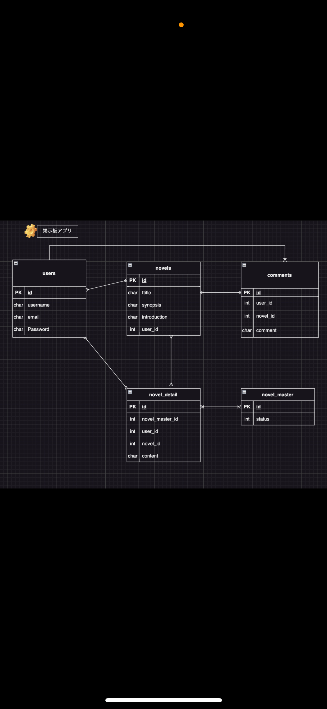
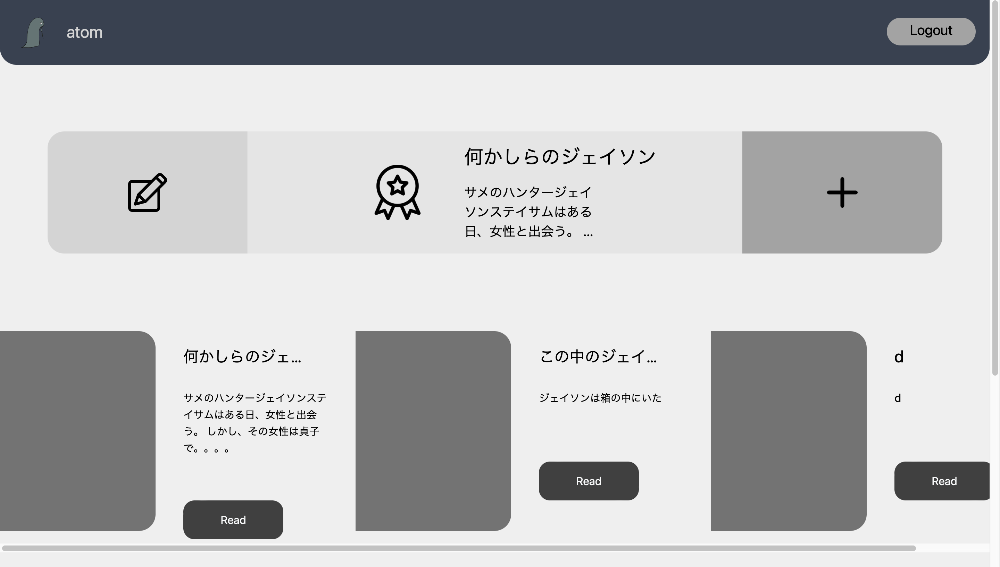
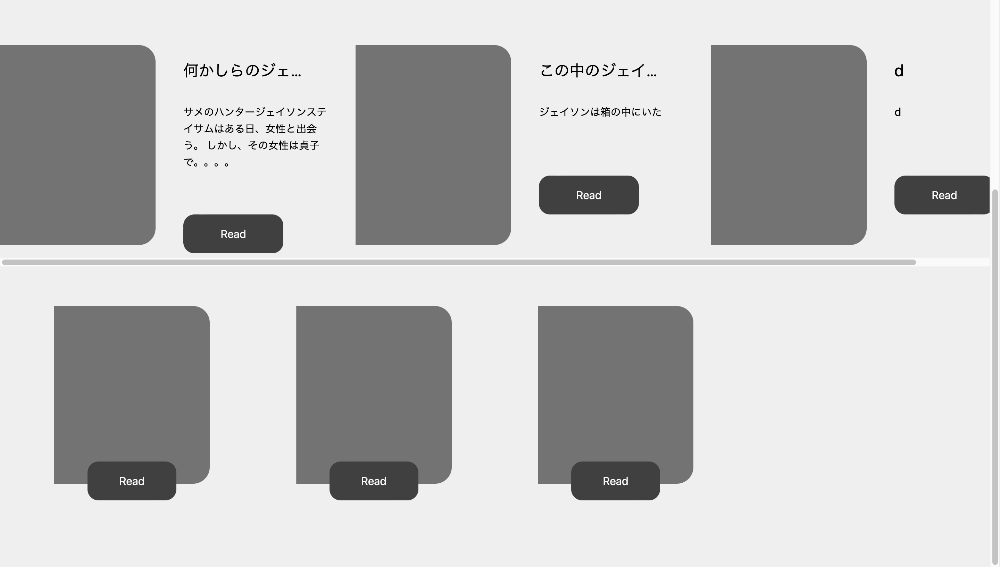
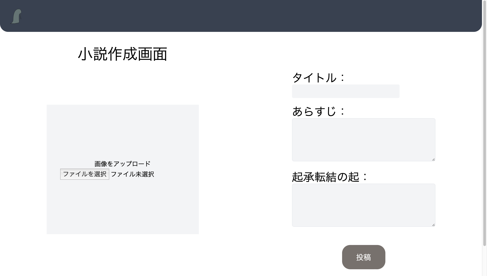
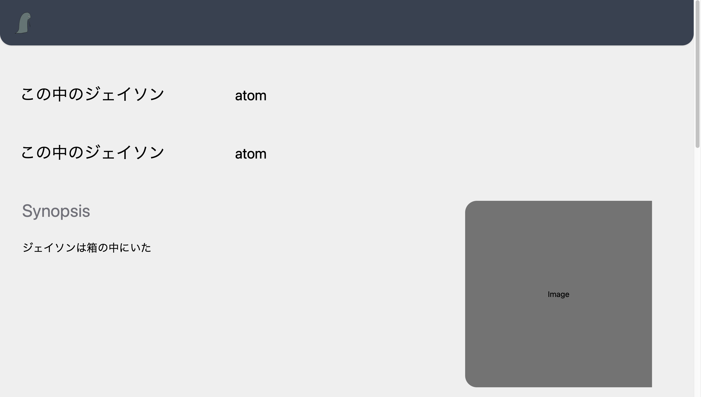
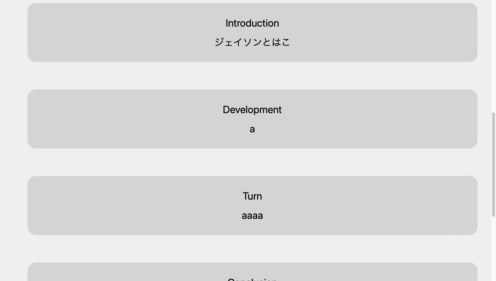
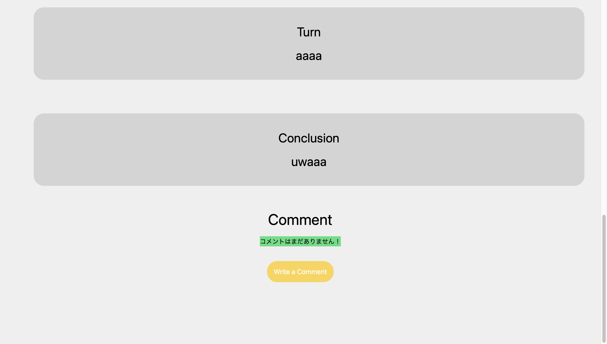
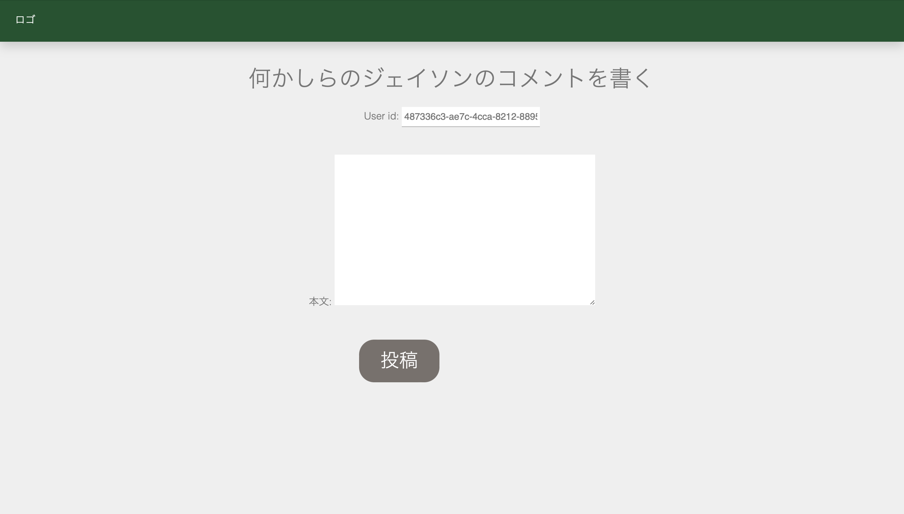
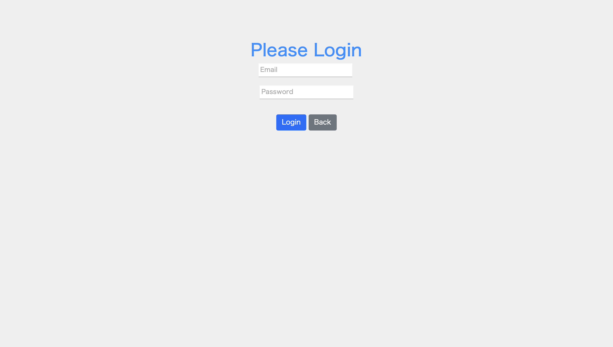
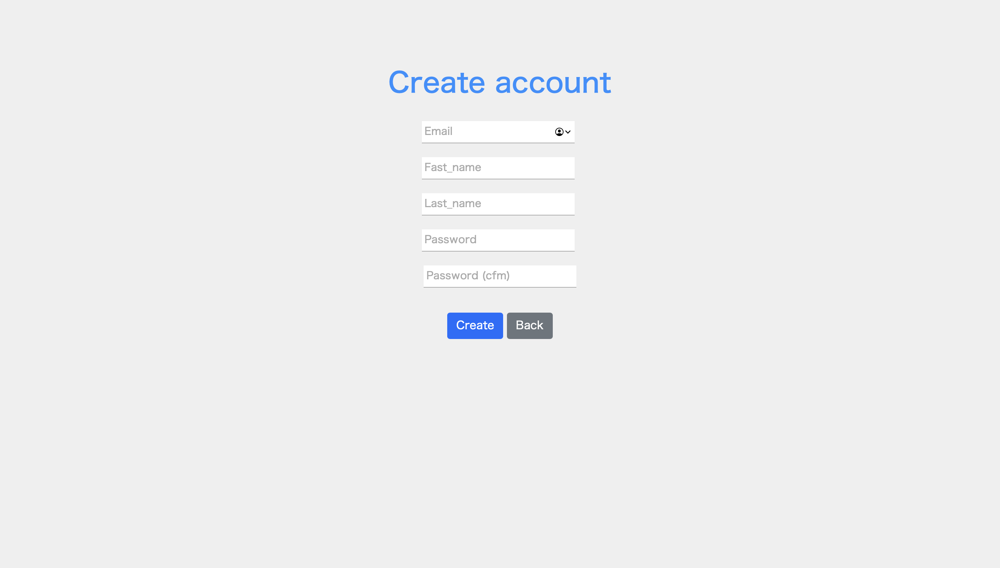

# 🪿 Change the DEJAVU of everyday

- This repository is about creating a web application of team **D**EJAVU
- Have fun!

### 🥨 Languages

### 🍑 Env

### 🦴 Design

### 🤿 Framework

  

## 🫥 About DEJAVU
### DEJAVUとは小説を書いてそれを他の人に繋ぎ、物語のリレーをしていくWebアプリケーションです。
### 毎日の日々がDEJAVUではなくて、何か少しずつ変わっているということを小説を通して伝えるという意味を名前に込めました。

- 開発期間:　約3ヶ月 (10.20 ~ 1.23)
- チーム・個人：　チーム(5名)
- ER図:　
- ペルソナ:　[DEJAVU PERSONA](https://docs.google.com/spreadsheets/d/1ncy-5R4Dad6RDKqWLslk-PTauZW9SM_X/edit#gid=1803559359)
- アイデアたち:　[DEJAVU IDEAS](https://docs.google.com/spreadsheets/d/1ncy-5R4Dad6RDKqWLslk-PTauZW9SM_X/edit#gid=2123999459)
- 要件定義書:　[DEJAVU REQUIREMENTS DEFINITION](https://docs.google.com/spreadsheets/d/1ncy-5R4Dad6RDKqWLslk-PTauZW9SM_X/edit#gid=752554769)

## ER

## 🥩 Screen Shots
### Home Page

- ユーザーが一番初めに見るページです。

- [ログイン状態は保持されるので、一度ログインしたら上に名前が表示されるデザインを考案しました。](https://github.com/takuma-shishido/dejavu/commitf4e810efea67bbe89edc855525b28146692f9954) by Taichi

 

### Home Page (Second View)

- スクロールした後のHomePageです。

- [HomePageのUIを担当しました。Figmaで基盤のデザインを作成し、HTMLとCSSを使ってコーディングすることはとても楽しかったです。本の表紙をイメージしReadボタンを配置しました。](https://github.com/takuma-shishido/dejavu/commit/8bfa28e3404152896196e774d387ca5de5883f85) by Aoi

 

### CreateNovelPage

- [そうですね、やっぱりユーザーが使いやすいようにフォームの大きさを意識しました。はい。なんなんあ次の質問を聞いてないです。ちゃうやんか。僕はマッドサイエンティストさ。イタイイタイ痛いよぉ全て壊しちゃうからね。](https://github.com/takuma-shishido/dejavu/commit/a202b2ba5ac4c670599fa2c8305d07bdec22acdb) by Taichi

 

### NovelDetailsPage

- [えええええ。ちょっと待って待って一回消して。ねえええふっふっふあ自動翻訳の音声字幕みたいなやつむずっわかった本当に]()

 

### NovelDetailsPage Second View

- [初めての共同開発だったから、結構ね難しいことがあったんだけどまあなんかこんな感じでディスコードを使って一緒にやるとかも楽しかったです。](https://github.com/takuma-shishido/dejavu/commit/c688fa3b1171fe7d5296d8a2a9d7f10a95063acd) by Amit

 

### NovelDetailsPage Second View

- [UIの編集を担当しました。起承転結を英語にしたことがアピールポイントです](https://github.com/takuma-shishido/dejavu/commit/2874cb0886468a68e89cde6e3f9ba3c91851a2e0) by Aoi

 

### WriteCommentsPage

- [え？？](https://github.com/takuma-shishido/dejavu/commit/4ef09884f020b46e901d5e8b370023e951ca7314) by everybody

 

### Login Page

- [ウザァいえ？？それをれ？俺のこと？宇宙のこと？？俺はエイリアンだから違うね。僕に開発は早いよ君らだから大丈夫そ？僕はログイン専門家さ。アカウントIDをなくすなんてへっちゃらさ 99%僕が担当しました。たくま大丈夫そ？じゃあ今からエイリアン作り直してみる？](https://github.com/takuma-shishido/dejavu/commit/80ddc5a8100c214f59de6dee381f8231959ccaea) by Utyuu & Takuma or マッドサイエンティスト

- [いらっしゃいませ。ご注文お決まりですか？あみと持ち帰りますか？かしこまりました。こちら商品になります。大変申し訳ありません。たいちは売り切れになります。こちら不良品しか在庫がない状態でして、、、](https://github.com/takuma-shishido/dejavu/commit/290c7b034a08d05ee9c04593c455563e3b530566) by Utyuu

 

### Sign Up Page

- [お月様こんばんは〜あおい？？ん？？なんかDEJAVUさエラーでない？？出ないよ。寿司ラーメンを食べたじゃん？それが胃から戻ってきたんだよね。リードしたら胃から出てきたよ。ちょっと見てもらっていいですか？](https://github.com/takuma-shishido/dejavu/commit/80ddc5a8100c214f59de6dee381f8231959ccaea) by Utyuu

## Team Member
- Leader: [Takuma Shishido](https://github.com/takuma-shishido) (33 contributes)
- Sub Leader: [Amit Commit](https://github.com/amitB034) (21 contributes)
- Boss: [Aoi Orio](https://github.com/aoiorio) (30 contributes)
- Snack: [Utyuu Anzai](https://github.com/Anzai1026) (11 contributes)
- Dancer: [Taichi Nakazato](https://github.com/NakazatoTaichi) (16 contributes)

 

# 🧊 Thank you for reading this.
This README.md was written by [Aoi Orio](https://github.com/aoiorio)